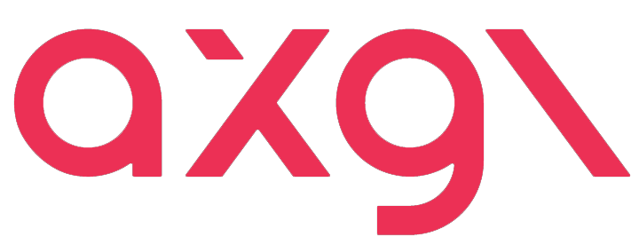

# ax Graphics Library "axgl": OpenGLES on Low Level Graphics API (Metal)

For many years, OpenGLES has served as a standard in graphics programming. However, with Apple marking OpenGLES as deprecated, its future support is uncertain. In these transitional times, we offer a bridge to ensure that the invaluable assets created with OpenGLES remain accessible and viable in the contemporary tech landscape.

**axgl is a uniquely crafted library that brings OpenGLES's API to life on Metal.** With this, you can harness the raw speed and performance of Metal, all while sticking to your familiar OpenGLES codebase.

## Key Features

- **Leverage Past Assets**: Utilize your existing OpenGLES code and experience the benefits of Apple's cutting-edge technology, Metal.
- **Seamless Transition**: axgl mirrors OpenGLES functions, providing a familiar API that requires minimal adjustments to your code.
- **High-Speed Performance**: Benefit from Metal's low-level access and optimizations, all within your OpenGLES codebase.

## Why axgl?

The technological landscape with Apple is ever-evolving. The deprecation of OpenGLES could significantly impact many developers. axgl was developed as the optimal tool to bridge this technological divide. To safeguard your past investments while smoothly transitioning to future tech, consider axgl as your go-to solution.

## Other platform support

[ax](https://axinc.jp/en/) is a company that specializes in low-level API implementations of 3D Graphics and AI on a variety of hardware. If you are interested in implementing OpenGL in other environments(e.g. Vulkan, DX12), please contact us at contact@axinc.jp.

## Metal backend for iOS

### Development Environment

OS: macOS Monterey Version 12.6.2  
Xcode: Xcode Version 13.3  

### How to build

Open the following project from Xcode.
AXGLExample/AXGLExample.xcodeproj

Select the target and build the project with Product->Build.

### AXGLExample : Sample Program

Since GLES runs on Metal, the implementation is as follows.

Returns a CAMetalLayer in layerClass of a class inheriting from UIView.
```
+ (id)layerClass
{
  return [CAMetalLayer class];
}
```

Create a default device for Metal at initialization time and specify the device and pixel format in CAMetalLayer.
```
- (void)initialize
{
   // Create default device and set Metal's Layer
  _metalLayer = (CAMetalLayer*)[self layer];
  _device = MTLCreateSystemDefaultDevice();
  _metalLayer.device = _device;
  _metalLayer.pixelFormat = MTLPixelFormatBGRA8Unorm;
  _metalLayer.contentsScale = [UIScreen mainScreen].scale;
  // ...
}
```

Since the Drawable of Metal is different from GLES, an on-screen Framebuffer is constructed by specifying CAMetalLayer as storage and creating a Renderbuffer.
For Apple GLES, this is done with the renderbufferStorage method specifying CAEAGLLayer.
```
- (void)setupOnscreenResources
{
  // Set the context
  BOOL res = [EAGLContext setCurrentContext:_context];
  if (res) {
    // Create Renderbuffer by specifying CAMetalLayer as Storage
    glGenRenderbuffers(1, &_colorRenderbuffer);
    glBindRenderbuffer(GL_RENDERBUFFER, _colorRenderbuffer);
    [_context renderbufferStorageFromLayer:GL_RENDERBUFFER fromLayer:_metalLayer];
    // Create a renderbuffer of depth
    GLsizei rb_width = (GLsizei)([_metalLayer drawableSize].width);
    GLsizei rb_height = (GLsizei)([_metalLayer drawableSize].height);
    glGenRenderbuffers(1, &_depthRenderbuffer);
    glBindRenderbuffer(GL_RENDERBUFFER, _depthRenderbuffer);
    glRenderbufferStorage(GL_RENDERBUFFER, GL_DEPTH_COMPONENT16, rb_width, rb_height);
    glBindRenderbuffer(GL_RENDERBUFFER, 0);
    // Attach to Framebuffer
    glGenFramebuffers(1, &_framebuffer);
    glBindFramebuffer(GL_FRAMEBUFFER, _framebuffer);
    glFramebufferRenderbuffer(GL_FRAMEBUFFER, GL_COLOR_ATTACHMENT0, GL_RENDERBUFFER, _colorRenderbuffer);
    glFramebufferRenderbuffer(GL_FRAMEBUFFER, GL_DEPTH_ATTACHMENT, GL_RENDERBUFFER, _depthRenderbuffer);
    // Remove the context
    [EAGLContext setCurrentContext:nil];
  }
}
```

### AXGLExampleSL : Sample using static library

iThis is a sample that creates a static library of libaxgl.a and uses it in an application. The source of the sample program is identical to AXGLExample.

Open the following project from Xcode and build it.
AXGLExampleSL/AXGLExampleSL.xcodeproj


## Note
This software uses glslang and SPIRV-Cross. Please refer to the following directory for the license.

glslang:
axgl/external/glslang

SPIRV-Cross:
axgl/external/SPIRV-Cross

OpenGL is a trademark or registered trademark of Hewlett Packard Enterprise in the United States and other countries.

## Software licence
The files in this repository are licensed under AGPLv3. For third parties' programs, see corresponding directories under /axgl/external. If you need the commercial license for our AGPLv3 parts, please contact to contact@axinc.jp
